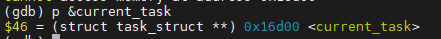

# kerneldebug：调试内核的一些快捷命令

[toc]

## 简介

本GDB插件用于qemu环境下的linux内核调试，主要提供了一些方便调试的命令，如快速查看堆信息的slabinfo命令、查看进程信息的taskinfo命令、快速解析结构体的destruct命令等。详情见下面介绍。

叠甲：由于linux内核涉及架构很多，我手头有的环境也就是qemu x86_64的，也没有很多测试样本，再加上本人编码能力巨菜，所以在一些其他的环境使用可能会有一些问题，或者qemu x86_64环境也可能有我目前没发现的问题。只能后续慢慢修改了。

## 用法

在gdb终端中：

```
source /path/kdbg.py
```


## 调试命令总览

总共提供命令如下：

- [destruct 以指定结构体格式解析一个地址的数据](#destruct命令)
- [taskinfo 打印进程信息](#taskino命令)
- [percpu 快速获取percpu变量](#percpu命令)
- [cpus/setcpus 打印/修改 当前环境的cpu数量信息](#cpus命令)
- [nodes/setnodes 打印/修改 当前环境NUMA node节点信息](nodes命令)
- [slabinfo 打印内核堆slab 信息](slabinfo命令)
- slabtrace 追踪slab分配情况(TODO)
- trunktrace 追踪一个堆块的分配与释放(TODO)
- pagetrace 追踪一个slab page的分配与释放(TODO)
- 一个酷炫的LOGO(TODO)

## 通用调试命令

### destruct命令

#### 功能

以给定结构体格式解码特定地址的数据，递归打印所有成员的信息。类似`pt/o`命令的输出，打印的信息包括：

- 递归打印结构体中所有可展开成员的值，指针不展开
- 打印每个成员相对于结构体的偏移
- 打印每个成员的大小

除此之外，该命令还支持已知某个结构体中某个成员的地址，然后解析整个结构体，使用场景是**有些结构体中的双链表成员指向的是下一个结构体的双链表成员，有时候我们只获取了双链表的指针，但该指针指向的是下一个结构体中的双链表成员，想获取结构体的起始地址，还需要进行偏移计算，只使用普通gdb操作非常麻烦。使用`destruct`命令可以一条命令解析整个结构体。**

可以参考下面语法和例子。

#### 语法

```
destruct <address> <type> [member]
destruct <expression> [member]
```

- 两种使用方法，第一种使用方法：
  - address：必选参数，想要解析的数据地址，也可以是一个结构体中某个成员的偏移。
  - type：必选参数，结构体名，以该结构体格式解析上面地址的数据；如果上面提供的是结构体某个成员的偏移，则type需要输入struct.member的格式，member是上面address 对应结构体成员的名字。
  - member：可选参数，如果觉得结构体太大，只想看其中某个成员的信息，则在后面增加成员名即可。则会只打印这个成员的信息。
- 第二种方法，直接传入一个gdb 结构体指针表达式：
  - expression：必选参数gdb结构体指针表达式，很多时候gdb会直接打印出类似`(struct task_struct *)0xffffffff82414940`这种格式的数据，可以直接将其拷贝作为参数给destruct 命令。
  - 同样可以加一个member 成员名，输出内容只打印该成员的信息。

#### 例子

```
destruct (struct kmem_cache *)0xffff888003041b00
destruct 0xffff888003041b00 kmem_cache
```

这两种写法含义相同，都是以`struct kmem_cache`结构体格式打印0xffff888003041b00处信息：


如果我们只想知道其中list结构体的信息，可以使用下面两条命令：

```
destruct (struct kmem_cache *)0xffff888003041b00 list
destruct 0xffff888003041b00 kmem_cache list
```

这样就会只打印list成员的信息。该成员是指向下一个slab cache的双链表结构。


该双链表指向的是下一个slab cache的lsit成员地址，如果我们想知道下一个slab cache成员的完整信息，可以拷贝next指针的值，然后使用kmem_cache.list解析下一个slab cache：

```
destruct 0xffff888003041a68 kmem_cache.list
```


同样也可以只看下一个slab cache 的list成员：

```
destruct 0xffff888003041a68 kmem_cache.list list
```


### percpu命令

#### 功能

给一个percpu变量偏移地址，打印出变量的实际地址。

#### 语法

```
percpu [cpuid] [expression]
```

- cpuid：可选，选择目标cpu 的per_cpu变量，如果不指定则默认选择当前cpu
- address：可选参数，per_cpu变量地址的表达式，可以直接传入一个percpu变量地址如`0x2ce60`，也可以传入变量符号如`filp_cachep->cpu_slab`。如果不指定则直接打印per_cpu的基地址
- 

#### 例子

```
percpu
```

打印当前cpu(cpu0)的per_cpu基地址：


```
percpu 0x2ce60
percpu filp_cachep->cpu_slab   # filp_cachep->cpu_slab == 0x2ce60
percpu 0 filp_cachep->cpu_sla  # current CPU id is 0
```

打印当前cpu(cpu0)的`filp_cachep->cpu_slab` 地址 


### cpus命令

打印总共多少cpus

```
(gdb) cpus
[+] The number of CPUs is 4
```

### setcpus命令

如果自动获取的cpu数量有误，支持手动修改cpu数量

```
(gdb) setcpus 4
[+] Set CPUs success, the number of CPUs is 4
```

### nodes命令

打印总共多少个NUMA nodes节点

```
(gdb) nodes
[+] The number of NUMA nodes is 2
```

### setnodes命令

如果自动获取的节点数量有误，支持手动修改nodes数量

```
(gdb) setnodes 2
[+] Set NUMA nodes success, the number of NUMA nodes is 2
```

## 进程相关命令

### taskino命令

#### 功能

可以提供进程名或进程号，打印给定进程的一些信息：

- 进程名、进程号等基本信息
- 父进程、子进程树结构、线程组 信息
- cred信息
  - uid, suid, euid, fsuid; 
  - gid, sgid, egid, fsgid;
  - user namespace
- name space信息
  - UTS, IPC, mount, PID, NET, cgroup

#### 语法

```
taskinfo [pid|name]
```

- pid：想要打印的进程号
- name：想要打印的进程名字，如果有多个进程同名，则会打印出所有进程号，后续需要自己使用进程号打印特定进程。
- 什么参数都不跟默认打印`current_task` 指向的当前进程信息

#### 例子

```
taskinfo
```

直接使用是打印当前进程信息：


```
taskinfo 1
taskinfo init
```

根据进程号或进程名打印特定进程：


```
taskinfo sleep
```

如果多个进程同名，则会打印出所有进程号，后续自己选择进程号打印：


## 内核堆slub调试

### slabinfo命令

#### 功能

对于一些slab相关的编译选项都会自动判断适配当前环境，如`CONFIG_SLUB_CPU_PARTIAL`、`CONFIG_SLAB_FREELIST_HARDENED`和`CONFIG_SLUB_DEBUG`。

对于5.16 前后对slab page的结构体解析支持。5.16之前使用`struct page`解析，5.16 之后使用`struct slab`解析。

显示一个slab cache 的基本信息、包括：

- slab cache基本信息：
  - name：slab cache的名字，即`struct kmem_cache`结构体的`name`字段
  - size：slab cache负责分配的堆块大小，即`struct kmem_cache`结构体的`size`字段
  - offset：空闲堆块在freelist中时next指针的偏移，即`struct kmem_cache`结构体的`offset`字段
  - page order：slab cache中每个slab page的阶数，即`struct kmem_cache`结构体的`oo`字段的高16位
  - objects：每个slab page被切分成多少个堆块，即`struct kmem_cache`结构体的`oo`字段的低16位
  - CPU aprtial：开启了`CONFIG_SLUB_CPU_PARTIAL`的时候cpu_slab->partial最多的页数
- cpu slab的信息：即`struct kmem_cache`结构体的`cpu_slab`字段，为`struct kmem_cache_cpu`结构体
  - CPUs：当前环境共多少个cpu
  - current cpu：当前使用cpu
  - cpu[i] slab 信息：具体某个cpu slab的一些信息：
    - pages：这个cpuslab现在可用page数量，通常是partial中page数量+1(freelist 来自一个page)
    - objects：可分配的堆块数量，freelist和partial中的各page的freelist数量之和
    - cpu slab freelist：
      - cpu slab正在使用的freelist来自的page结构体，即`struct kmem_cache_cpu`结构体中的`page`字段
      - 可立即分配的堆块freelist，即`struct kmem_cache_cpu`结构体中的`freelist`字段
    - partial：CPU 的partial列表，依次显示列表中的所有page和page的freelist
      - page，partial列表中的page
      - freelist，每个page的freelist
- node slab的信息：即`struct kmem_cache`结构体的`node`字段，为`struct kmem_cache_node`结构体
  - NUMA nodes：当前环境共有多少个NUMA nodes
  - node[i] slab 信息，具体某个node slab 的一些信息
    - partial pages：这个node的partial列表中有多少page
    - has full list：是否开启了full list，开启`CONFIG_SLUB_DEBUG`则会开启这个双链表
    - full pages：full 列表中是否有page，99.999%的情况都是没有的
    - partial 列表：依次打印partial双链表中所有page和其freelist，类似cpu partial列表的显示方式
    - full列表：同上partial列表

**上述信息遇到结构体均会打印出形如`(struct kmem_cache_cpu *)0xffff88807d82c980`的内容，可以直接拷贝然后使用gdb命令`p * (struct kmem_cache_cpu *)0xffff88807d82c980`来打印具体内容。**

slab相关信息比较多，该条命令支持部分打印，可以选择性只打印cache整体信息，或cpu slab 信息或node slab信息。具体见语法和例子。

#### 语法

```
slabinfo <slabname> [cache|cpu|node] [allcpu|allnode|alllist|allinfo]
```

- 必选参数
  -  `<slabname> `：可以是slabcache 的名称如`kmalloc-256`，也可以是slabcache的符号名称如`filp_cachep`，因为slab重用机制，有时候直接搜slab名字是搜不到该slab 的，需要使用其全局符号(一般会重用的slab 都有全局符号)。
- 可选参数
  - 以下三个参数如果都不设置，则默认全部打印这三个的信息，一旦指定了一个或两个，则只打印指定的信息：
    - `cache`：可选参数，打印cache的基本信息
    - `cpu`：可选参数，打印cpu slab的基本信息
    - `node`：可选参数，打印node的基本信息
  - 以下四个参数如果不设置，则打印其默认打印的内容
    - `allcpu`：打印全部cpu的信息，**默认只打印当前cpu的信息**
    - `allnode`：打印全部NUMA node的信息，**默认只打印第一个node的信息**
    - `alllist`：打印freelist中全部的objects，**默认只打印两条，为了防止freelist太长，篇幅太长**
    - `allinfo`：相当于同时指定上述三个

#### 例子

```
slabinfo kmalloc-1k
```

直接查看特定slab，如kmalloc-1k（slab 名）


当前环境共有四个cpu和2个NUMA node，可以看到默认只打印了当前的cpu0和第一个node node0，对于freelist比较长的页只显示前两个。

```
slabinfo kmalloc-1k cpu
```

通常情况下可能我们队node 中的信息不太感兴趣，cache中的信息也是看一遍就知道了，基本每次只是看一下cpu slab中的信息更新情况，可以增加cpu参数只打印cpu信息：


```
slabinfo kmalloc-1k cpu allcpu alllist
```

如果想要查看其他cpu的信息，并且想让freelist显示完整，可以相应的增加allcpu 和alllist 打印参数：


cpu node cache allcpu allnode alllist all7个参数是可以随意组合的，前三个参数限制打印的范围，后三个参数限制打印的详细程度，如：

```
slabinfo kmalloc-1k all # 打印全部信息，所有cpu、所有node、完整freelist
slabinfo kmalloc-1k all node # 打印所有node 的信息，显示完整freelist，虽然指定了all，但打印范围只限定node，所以不会打印cpu和cache信息
```

## 技术细节

### 环境相关

#### percpu变量

在Linux内核中，Per-CPU变量是一种特殊类型的全局变量，它为系统中的每个处理器核心提供一个唯一的实例。这意味着，如果你在一个四核处理器的系统上定义了一个Per-CPU变量，那么实际上就创建了四个独立的变量实例，每个核心都有一个。

通常情况下，直接获取per_cpu变量只会获取到一个非常小的值：



这肯定是无法访问的地址，其实这代表这这个per_cpu变量的**偏移**，实际的per_cpu遍历需要找到对应cpu的per_cpu变量基地址，每个cpu都有自己的和其他cpu不同的per_cpu变量基地址，加上相同偏移就是对应cpu的per_cpu变量实际的值。

获取per_cpu变量的基地址的方法主要有两个：

- gs_base寄存器：gs_base寄存器存放当前cpu的per_cpu偏移(前提是当前环境有这个寄存器)：

  

- `__per_cpu_offset`全局数组，存放着各个cpu的per_cpu变量基地址，根据cpu下标寻址，如果你的环境只有4个cpu，则只有前四个是有效的，代表各个cpu的per_cpu遍历基地址：

  

获取到per_cpu遍历基地址之后，加上每个per_cpu变量的偏移就是对应的实际地址：


#### NUMA node

NUMA（Non-Uniform Memory Access）是一种计算机内存设计，用于多处理器系统，这在大规模服务器和高性能计算领域常见。在NUMA系统中，每个处理器都有自己的本地内存，称为node，而且每个处理器还可以访问系统中其他处理器的内存。访问本地内存的速度会比访问非本地（即其他处理器的）内存快，这就导致了"非一致"的内存访问时间，因此得名"非一致内存访问"。

qemu 中可以通过类似如下命令启动两个node节点的环境：

```sh
qemu-system-x86_64 -smp 2 -m 2G -numa node,nodeid=0,cpus=0 -numa node,nodeid=1,cpus=1 -hda your_disk_image
```

在堆相关操作的时候需要获取操作系统中的node数量，可以访问全局变量`slab_nodes`，这是一个比特数组类型，统计其中1的数量即可获取拥有slab的node数量。

### 进程相关

#### task_struct 进程树结构

在 Linux 中，每个进程都有一个父进程。当一个进程创建新的进程（子进程）时，该进程就成为这个新进程的父进程。这种关系主要在进程调度、资源分配和权限控制等方面起作用。linux中所有进程都是由1号进程派生出来的，这样，每个进程都有自己的父进程也可能有自己的子进程，进而形成一种树形结构。

在数据结构上，我们使用`struct task_struct` 结构体来表示一个进程信息，其中使用`parent`,`children`,`sibling`来表示这个树形结构：

```c
struct task_struct {
	···
	struct task_struct __rcu	*parent;
    struct list_head		children;
	struct list_head		sibling;
    struct task_struct		*group_leader;
	···
}
```

- `parent`是一个指向`task_struct`的指针，它指向创建当前进程的进程（也就是父进程）。每个进程在被创建时都会有一个父进程。
- `children` 是一个双链表的表头，用于存储当前进程创建的所有子进程的信息。当一个进程创建一个新的子进程时，这个新的子进程会被添加到`children`链表中。
- `sibling` 是一个双链表的表头，它用于将具有相同父进程的所有进程（也就是兄弟进程）链接在一起。每个进程的`task_struct`都包含一个`sibling`链表，**这个链表通过父进程的`children`链表进行链接。**
- group_leader` 是一个指向`struct task_struct`的指针，用于指向当前进程所在的线程组的"领导者"线程（也就是这个线程组中的第一个线程）。在Linux中，线程是通过克隆（clone）进程来创建的，线程组是由通过某个特定的克隆标志（例如`CLONE_THREAD`）克隆出来的一组线程。这组线程共享某些资源，如PID等，它们在系统中表现为一个单一的实体。

**需要注意的是在代码实现上，父进程的`children`表头的`next`和`prev`指针指向的是子进程的`sibling`的地址，也就是父进程的`children`和所有子进程的`sibling`结构在同一个双链表中。这是一个坑点，在C语言使用for_each等遍历双链表的接口不用怎么注意，但在gdb调试的时候，拿到的指针其实是下一个结构体中的某个成员的地址，需要根据成员所在结构体的偏移计算出结构体的起始地址，这时候如果不指定指针实际指向的成员，就会造成结构体地址计算出错。**

类似结构用图表示如下：


### 堆调试

#### 获取信息

参考[linux kernel\]slub内存管理分析(0) 导读](https://blog.csdn.net/Breeze_CAT/article/details/130015137)

主要根据之前分析的slub算法的数据结构，获取相关数据结构的信息，包括：

- `struct page`/`struct slab`，在小于5.17版本中中使用`struct page`表示slab page，但在大于5.17版本中使用`struct slab`结构体，但本质都是解析的`struct page`的数据。

- `struct kmem_cache_cpu` cpu slab，这是一个per_cpu变量，需要按照上述per_cpu变量的获取方式获取。

- `struct kmem_cache_node` node slab，在slab cache中是一个数组结构，当前操作系统环境有多少NUMA node数量就有多少个node结构体。

- `struct kmem_cache` slab的缓存结构，通过以上所有结构体都需要先获取该结构体之后才能获取。

  - 操作系统中所有slab cache都通过`slab_caches`全局变量连接到一个双链表中，也就是说，遍历`slab_caches`双链表就可以访问所有的slab cache。

  - 每个slab cache都有自己的`name`，可以通过输入特定名字来检索特定的slab cache

  - 但存在[slab 重用机制](https://blog.csdn.net/Breeze_CAT/article/details/130015522?spm=1001.2014.3001.5502)导致会导致某两个slab cache使用同一个cache，然而每个cache只有一个名字，这就会导致你搜索和别的cache重用的cache搜索不到。但一般这些slab都有自己的全局变量名，如`filp_cachep`，我们会发现`filp_cachep->name`是"pool_workqueue"这就是slab 重用机制导致的。为了能快速搜索这类slab，需要支持对符号的搜索。

    


#### 一些编译选项

`CONFIG_SLUB_DEBUG` 开启之后node中会有`full`双链表，虽然`full`中基本不会有东西，但还是需要打印一下。

`CONFIG_SLUB_CPU_PARTIAL` 开启之后`kmem_cache_cpu`中才会有`partial`单链表，需要考虑没开这个的环境，在脚本中直接访问`partial`可能会报错。

`CONFIG_SLAB_FREELIST_HARDENED` 开启之后freelist 的指针会被混淆，无法直接寻址，需要先解析出原本指针。

### gdb脚本相关

#### 常用函数

#### 一些gdb对象使用
